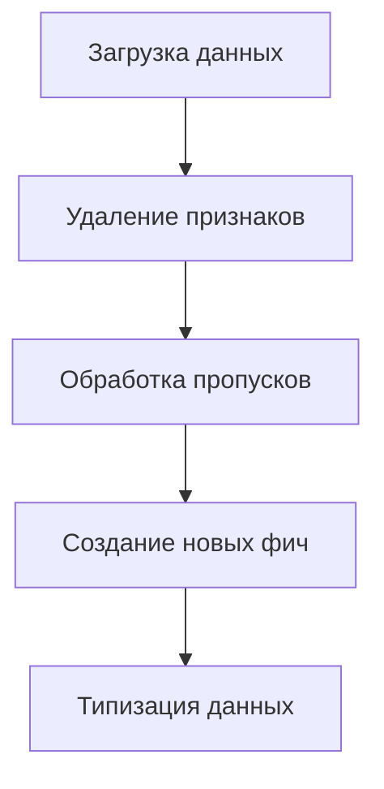
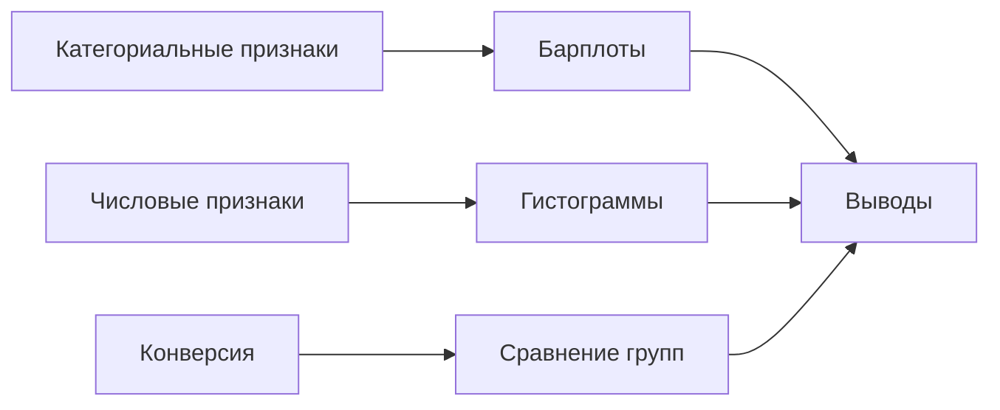
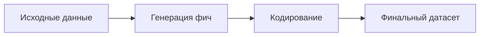
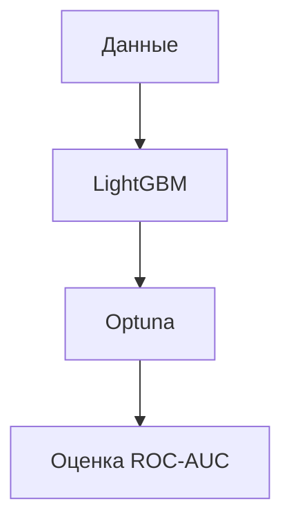
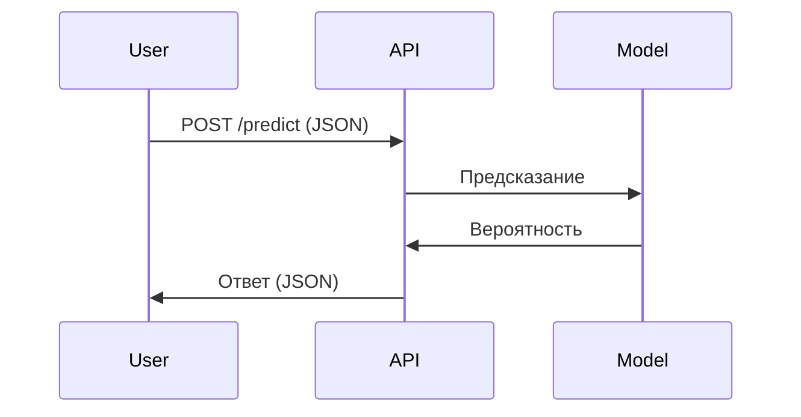

# План работ

---

## **1. Цель проекта**  
Разработать модель машинного обучения для прогнозирования вероятности совершения пользователем целевого действия (оформление заявки, заказ звонка) на сайте «СберАвтоподписка».  
**Ожидаемые результаты:**  
- ROC-AUC ≥ 0.65;  
- API для интеграции модели в бизнес-процессы;  
- Рекомендации по оптимизации рекламных кампаний и UX.

---

## **2. Этапы работ**

### **2.1. Подготовка данных**  
**Срок:** 1 дня.  
**Задачи:**  
1. **Обработка признаков в `ga_sessions.pkl`:**  
   - **Удаление малозначимых признаков:**  
     - `device_model` (>90% пропусков).  
     - `device_brand` (30% пропусков, но `device_category` и `device_browser` сохраняются).  
   - **Обработка `utm_source`:**  
     - Заполнение пропусков модой.  
   - **Очистка геоданных:**  
     - Удаление `geo_country="not_set"`.  
     - Удаление городов с частотой < 1500 (порог можно уточнить).  
     - Создание признака `is_million_city` (1, если город-миллионник в РФ).  
     - Удаление исходного `geo_city`.  

2. **Обработка `ga_hits.pkl`:**  
   - **Удаление признаков:**  
     - `hit_referer` (>40% пустых).  
     - `hit_time` (>65% пустых).  
   - **Обработка событий:**  
     - Заполнение `event_label` модой внутри групп `event_action`.  
     - Удаление редких `event_action` (порог: частота < 10).  
   - **Работа с датами:**  
     - Извлечение признаков: день недели, выходной/будний, время года.  
     - Отказ от анализа локального времени (из-за сложности).  
   - **Проверка дубликатов:**  
     - Удаление полных дубликатов по `session_id` + `hit_number`.  

3. **Общие шаги:**  
   - Преобразование категориальных признаков в `int` (после очистки).  
   - Замена специфических null-значений (например, `utm_medium="(none)"` → `NaN`).  

**Схема обработки данных:**  


---

### **2.2. Разведочный анализ (EDA)**  
**Срок:** 2 дня.  
**Задачи:**  
1. **Анализ категориальных признаков:**  
   - Барплоты для `utm_source`, `utm_medium`, `device_category`.  
   - Анализ `hit_number`:  
     - Среднее количество действий в сессии.  
     - Номер действия, на котором происходит целевое событие.  

2. **Распределения:**  
   - Гистограммы для `visit_date` (интервал: 1 день) и `visit_time` (интервал: 1 час).  

3. **Конверсия:**  
   - Разделение на группы:  
     - Органический трафик: `utm_medium ∈ {organic, referral, "(none)"}`.  
     - Платный трафик: остальное.  
   - Расчёт конверсии (сессия с ≥1 целевым действием) внутри групп.  
   - Визуализация: `sns.barplot(x='traffic_type', y='conversion_rate')`.  

4. **Корреляционный анализ:**  
   - Тепловая карта для числовых признаков (например, `visit_number`, `session_duration`).  
   - Удаление линейно-зависимых признаков (например, если `corr > 0.8`).  

**Схема EDA:**  


---

### **2.3. Фиче-инжиниринг**  
**Срок:** 1 дня.  
**Задачи:**  
1. **Создание новых признаков:**  
   - `is_mobile` (бинарный, на основе `device_category`).  
   - `session_duration` (разница между первым и последним `hit_time`).  
   - `traffic_type` (органический/платный).  

2. **Кодирование:**  
   - One-Hot для `device_os` (если категорий ≤ 10).  
   - Target Encoding для `geo_country` (после очистки).  

**Схема:**  


---

### **2.4. Построение модели**  
**Срок:** 3 дня.  
Задачи:

1. Выбор алгоритмов:
   - Бейзлайн: Логистическая регрессия.
   - Оптимизация: LightGBM + Optuna для подбора гиперпараметров.
2. Оценка метрик:
   - Основная: ROC-AUC.
   - Дополнительные: Precision, Recall.
3. Интерпретация:
   - SHAP-значения для анализа важности признаков.



---

### **2.5. Упаковка модели**  
**Срок:** 1 дня.  
**Задачи:**  

1. Создание API:
   - Использование Sanic/FastAPI для развертывания.
   - Пример эндпоинта: /predict (возвращает вероятность конверсии).
2. Тестирование:
   - Проверка на тестовых данных (пример входного JSON).
3. Документация:
   - Инструкция по запуску API.


---

### **2.6. Формирование выводов**  
**Срок:** 1 дня.  
**Задачи:**  

1. **Анализ результатов:**
   - Ключевые факторы конверсии (например, utm_source=email).
   - Проблемные зоны (например, низкая конверсия мобильных пользователей).
2. **Рекомендации:**
   - Увеличение бюджета на те или иные типы воронок.
   - Оптимизация работы той или иной версии БП/ресурса (например, сайта).

---

## **3. Ресурсы**  

- Инструменты: Python, Pandas, Scikit-learn, LightGBM, Optuna, Sanic/FastAPI, SHAP.
- Данные: ga_sessions.pkl, ga_hits.pkl. 
- Команда: Аналитик (2 чел.), Data Scientist (1 чел.), Team Lead (1 чел.).

---

## **4. График работ**  
| Этап               | Срок (дни) | Статус        |
|---------------------|------------|---------------|
| Подготовка данных   | 1          | Обновлён      |
| EDA                 | 2          | Обновлён      |
| Фиче-инжиниринг     | 1          | Обновлён      |
| Построение модели   | 3          | Запланировано |
| Упаковка модели     | 1          | Запланировано |
| Выводы              | 1          | Запланировано |

---

## **5. Риски и меры их минимизации**  

1. **Недостаток данных:**
   - Использование аугментации данных (например, SMOTE для дисбаланса классов).
2. **Переобучение модели:**
   - Регуляризация (L1/L2), кросс-валидация.
3. **Низкая ROC-AUC:**
   - Эксперименты с другими алгоритмами (CatBoost, XGBoost).
4. **Низкая информативность `hit_page_path`:**  
   - Отказ от анализа пути страниц, если не удаётся извлечь значимые фичи.  
5. **Сложности с геоданными:**  
   - Использование агрегированных признаков (`is_million_city`).  

---

## **6. Ожидаемые результаты**

1. **Jupyter Notebook с EDA, кодом модели и выводами.**
2. **Файлы модели (model.pkl) и API (app.py).**
3. **Отчёт с рекомендациями для бизнеса (PDF).**
``` 

**Примечания:**  
- Все изменения выделены в разделах **2.1** и **2.2**.  
- Mermaid-диаграммы обновлены для отражения новых шагов.  
- Риски дополнены с учётом специфики данных.